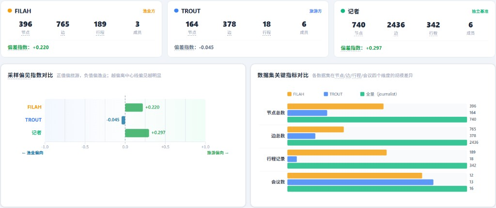
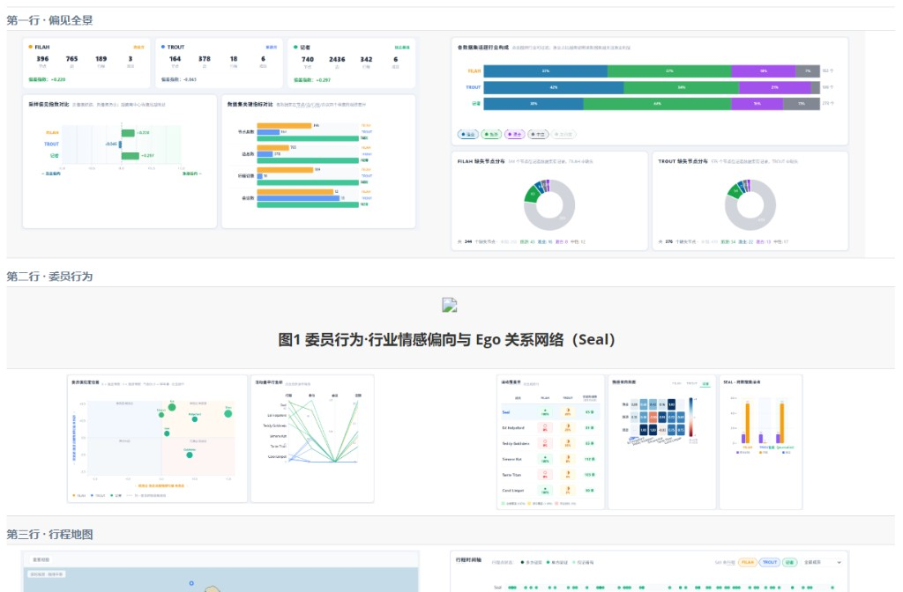
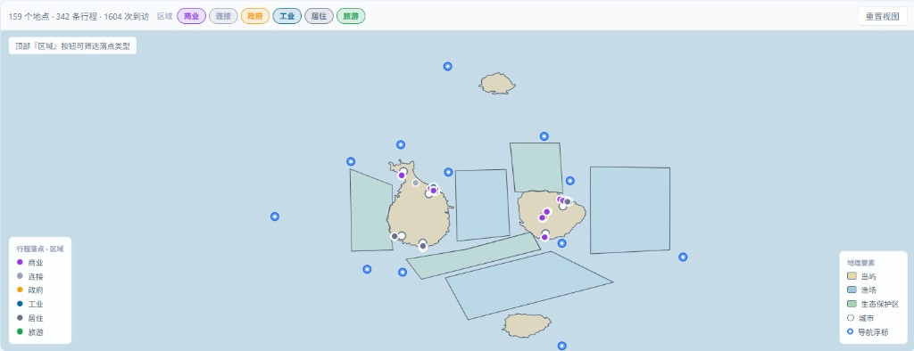
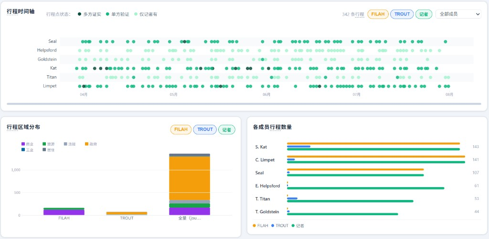

# Entry 名称：COOTEFOO 经济监督委员会偏见调查

**VAST Challenge 2025 · Mini-Challenge 2**

---

**团队成员：**

曾昭祥 2312190219

张贤文 2312190210

钱易 2402100132

**使用的工具：** HTML、CSS、JavaScript、Vue 3、TypeScript、D3.js、Python、Pinia、Vite

**大约总共花了多少小时来完成这次提交？**

116小时

**在 2025 年 VAST Challenge 完成后，我们可以将您的提交内容发布在视觉分析基准存储库中吗？** 

是

---

## 问题与挑战

数十年来，Oceanus 一直享有相对简单、以渔业为基础的经济。近年来旅游业大幅扩张，带来显著变化。当地政府设立监督委员会——**Commission on Overseeing the Economic Future of Oceanus（COOTEFOO，海洋国经济未来监督委员会）**——监测当前经济并就为未来做准备提供建议。记者 Edwina Darling Moray 获得三份 COOTEFOO 委员会知识图谱数据集：**FILAH**（渔业方）、**TROUT**（旅游方）与 **journalist**（记者全量基准）。渔业方指控委员会偏袒旅游，旅游方指控委员会偏袒渔业。我们的任务是在视觉分析支持下，帮助 Moray 判断这些指控是否成立、委员会真实行为如何、子集与全量结论有何差异，并对具体委员做深度对比。

具体问题：

1. 基于 TROUT 与 FILAH 提供的数据集，用视觉分析判断各方指控是否被**其自身记录集**所支持。即：开发可视化，突出 TROUT 与 FILAH 数据集中的偏见（若存在）。在任一数据集中，COOTEFOO 成员行为是否有偏见证据？
2. 作为记者，Moray 希望更完整地了解 COOTEFOO 的行动与活动。她已将 TROUT、FILAH 的数据与补充记录合并为单一知识图谱。为该合并知识图谱设计视觉分析方法，查看 COOTEFOO 成员如何分配时间。**委员会整体是否偏袒？** 为结论提供视觉证据。
3. TROUT 与 FILAH 数据集不完整。用可视化对比：分别从 TROUT、FILAH 数据集得出的结论，与**全量数据集**中的行为相比如何？在全量背景下，TROUT 的指控是被加强、削弱还是不变？
4. 设计可视化，使 Moray 可选择一人，突出该人在不同数据集中行为的差异，聚焦各数据集讲述的故事对比。
   1. 至少选择一名被 TROUT 指控的 COOTEFOO 成员，说明使用更完整数据集后，对其活动的理解如何变化。
   2. 原 TROUT 数据中最影响判断变化的关键缺失证据是什么？
   3. 在全量数据背景下，FILAH 数据集的采样偏见对谁的行为影响最大？
   4. 在全量数据集背景下，展示 FILAH 数据的偏见。

---

## 分析指标说明（读图前提）

系统在 Python 后端将知识图谱预处理为前端指标，采用以下定义：

**偏差指数 bias_index**（基于委员 `participant` 边，仅统计 fishing / tourism 议题）：

```
bias_index = (旅游活动数 − 渔业活动数) ÷ (旅游活动数 + 渔业活动数)
```

| 取值 | 含义 |
|------|------|
| **+1** | 完全偏旅游 |
| **0** | 渔业/旅游均衡 |
| **−1** | 完全偏渔业 |

**活动覆盖率 coverage**：

```
coverage(成员, D) = 该成员在数据集 D 中的活动数 ÷ 该成员在记者数据集中的活动数
```

**情感均值 sentiment_mean**：取自 `participant` 边的 `sentiment` 字段，范围 [−1, 1]，在热图中以红蓝发散色阶呈现。

---

## 系统概况

**图1 系统概况** — 下列拼版为同一总图，自上而下覆盖三个分析模块，用于总览界面布局与图表组成（非逐题分析用图）。

<table width="100%" cellspacing="6" cellpadding="0" style="border:none; margin:0 auto;">
<tr>
<td colspan="3" style="border:none; padding:4px 0 2px; font-size:12px; color:#64748b; text-align:left;"><b>模块一 · 偏见全景</b></td>
</tr>
<tr>
<td width="50%" align="center" style="border:none; vertical-align:top;">

</td>
<td width="50%" align="center" style="border:none; vertical-align:top;">

</td>
</tr>
<tr>
<td colspan="3" style="border:none; padding:10px 0 2px; font-size:12px; color:#64748b; text-align:left;"><b>模块二 · 委员行为</b></td>
</tr>
<tr>
<td width="33%" align="center" style="border:none; vertical-align:top;">

</td>
<td width="34%" align="center" style="border:none; vertical-align:top;">

</td>
<td width="33%" align="center" style="border:none; vertical-align:top;">

</td>
</tr>
<tr>
<td colspan="3" align="center" style="border:none; vertical-align:top; padding-top:6px;">

</td>
</tr>
<tr>
<td colspan="3" style="border:none; padding:10px 0 2px; font-size:12px; color:#64748b; text-align:left;"><b>模块三 · 行程地图</b></td>
</tr>
<tr>
<td width="50%" align="center" style="border:none; vertical-align:top;">

</td>
<td width="50%" align="center" style="border:none; vertical-align:top;">

</td>
</tr>
</table>

我们的可视化应用程序采用**左侧导航 + 右侧主视图**布局，包含三个相互补充的分析模块，对应「宏观偏见 → 个体行为 → 时空证据」三层调查逻辑：

| 模块 | 核心图表 |
|------|----------|
| **偏见全景** | KPI 指标卡、采样偏见指数对比、数据集关键指标对比、话题行业构成、FILAH/TROUT 缺失节点分布 |
| **委员行为** | 委员偏见定位散点图、活动量平行坐标、活动覆盖率矩阵、情感倾向热图、跨数据集活动对比、关系网络（Ego） |
| **行程地图** | Oceanus 官方地图、行程时间轴（含证据一致性图例）、行程区域分布、各成员行程数量 |

**设计思路：**

记者 Moray 需要判断 FILAH 与 TROUT 各自能否用**自身提交的记录**支撑对委员会的指控，并在合并全量记录后辨认真实行为与子集叙事之间的偏差。知识图谱中委员、会议、行程、议题以多种边相连，若直接阅读原始 JSON，调查员极易被单方材料的规模或情感色彩带偏。因此，我们将系统组织为三个由粗到细、相互印证的视图，并始终以记者全量数据集（journalist）作为对照基准：

- 偏见全景模块并列展示三个数据集的节点规模、偏差指数与缺失节点，使 Moray 可以清晰看出 FILAH 与 TROUT 数据集中「漏人、漏行程、删议题」等采样偏见。
- 委员行为模块在同一坐标系下对比六名成员在三个数据集中的活动量、覆盖率与情感倾向，并支持点击成员后展开个人跨数据集活动与关系网络，以回答委员会整体是否偏袒以及个体故事如何被子集改写。
- 行程地图模块将 trip 落点与时间轴叠加在 Oceanus 官方底图上，用空间分布与证据一致性图例检验前述议题偏见是否体现在实地考察中。

**交互设计要点：**

- 委员行为页支持**点击成员行/散点/平行坐标线条**联动选中，右侧展开「跨数据集活动」与「关系网络」。
- 情感热图支持 FILAH / TROUT / 记者三标签切换，对比同一成员在不同材料中的「有值 / 缺失」。
- 行程地图页采用**地图 + 时间轴 + 统计图**纵向联动：时间轴顶栏提供 FILAH / TROUT / 记者**多选数据集选项**与成员下拉，地图与成员统计随当前选中数据集与成员同步过滤；记者模式下时间轴以绿点深浅标注**多方证实 / 单方验证 / 仅记者有**。
- 地图顶栏提供**落点区域类型多选选项**（商业、政府、旅游等），可对比不同功能区落点分布；
- 地图落点支持点击选中与悬停高亮，非焦点落点半透明显示以便对比；选中成员时叠加该成员行程路径折线。
- 各图表标题旁集成 **TermExplanation** 术语悬浮说明（包括各类分析指标），降低 Moray 等非图谱专家的理解门槛。

---

## MC2.1（Q1）：各方指控是否被其自身数据集支持？


<center>图2-1 偏见全景 · 数据集规模与会议对比</center>


<center>图2-2 偏见全景 · 采样偏见指数与话题行业构成</center>

图2-1 显示 FILAH 数据集有 189 条行程，委员仅 3 人（Seal、Simone Kat、Carol Limpet）；TROUT 数据集六名委员齐全，行程却仅 18 条。两数据集的话题一致，会议数量（12 对 13）接近，容易误判它们一样完整，实则行程与人员严重失衡。

FILAH 整体偏差指数（bias_index）为 +0.220，方向上有利于渔业方「委员会偏旅游」的指控；TROUT 为 −0.046，几乎中性，旅游方「偏渔业」缺乏数值支撑。图2-2 中 FILAH 中渔业与旅游议题占比相同，议题数量看似均衡，偏差指数却仍为正值，说明渔业方在选材时可能更侧重能让委员会**显得倾向旅游**的会议与讨论，而不只是议题条目的多少。


<center>图3-1 行程地图 · FILAH 行程区域分布</center>


<center>图3-2 行程地图 · TROUT 行程区域分布</center>

图3-1 显示 FILAH 数据集 165 次落点访问中，以商业区和旅游区为主，实地活动高度指向旅游经济界面；图3-2 则表明 TROUT 数据集 76 次访问中，政府区居多，商业与旅游较少。前者为「偏旅游」提供了空间证据，但建立在漏掉 Helpsford、Goldstein、Titan 三人的前提下；后者把场景锁定在机关会议，政府区落点不等于渔业偏好，旅游方指控缺少行为级依据。


<center>图4 委员行为 · 活动覆盖率矩阵</center>

图4 为委员行为页「活动覆盖率」矩阵。FILAH 列中 Kat、Limpet、Seal 覆盖率均为 100%，Helpsford、Goldstein、Titan 为 0%；TROUT 列中 Kat、Limpet 仅约 8% 与 3%，Helpsford、Goldstein 相对较高。两列颜色分布互斥，表明两数据集呈现的是两套不同的证人组合，而非同一委员会全貌——这本身就是采样偏见的体现。


<center>图5 偏见全景 · FILAH 与 TROUT 缺失节点分布</center>

图5 为偏见全景最下行 FILAH / TROUT「缺失节点分布」环图。FILAH 共缺 344 个、TROUT 共缺 576 个（相对记者全量）。环图按议题行业着色：可识别类别中旅游类缺失多于渔业类，缺失呈定向性；TROUT 缺失总量更大，与图2-1 中仅 18 条行程相呼应。

**数据异常与跨图对照：** 图2-1 若仅看会议数（12 对 13），会以为两数据集「外壳」一样厚；但同图行程悬殊（189 对 18）、人员覆盖亦不对等，说明**账本条目**层面可能不完整。图3-1、图3-2显示：落到地图上，FILAH 落点堆在商业区与旅游区，TROUT 落点堆在政府区——同一委员会若被如实记录，空间足迹不应随提交方切换而变成两套几乎不重叠的景观。换言之，**条目规模**（会议、行程等图谱计数）与**空间行为**（委员实际去了哪里）有被拆开编排嫌疑：一方用「会议差不多」营造完整感，再用落点图案支撑「偏旅游」；另一方保留政府区场景，却删掉多数旅游实地。图4、图5 进一步显示这种编排还伴随删人、删节点，猜测整体更像是选择性剪辑，而非随机性缺漏。

**结论：** FILAH 数据集部分支持「委员会偏旅游」——偏差指数为正、商业/旅游落点密集，但半数委员缺席，不能代表委员会整体。TROUT 数据集几乎不支持「偏渔业」——偏差指数接近零，空间证据主要是政府区会议场景。两数据集均有明显采样偏见，Moray 不应单独采信任一方；它们表现出双方可能都在裁剪记录，而非指控已被自身数据充分证实。

---

## MC2.2（Q2）：委员会整体是否偏袒？成员如何分配时间？


<center>图6 偏见全景 · 记者全量整体偏差指数</center>

图6 在全量知识图谱上汇总委员会渔业/旅游议题参与：记者数据集整体偏差指数为 **+0.297**，呈**轻度偏旅游**。该值离 +1 较远，更接近经济转型背景下议题关注略向旅游倾斜，尚不足以单独证明「委员会集体蓄意偏袒」；但方向明确，Moray 不能称委员会对两业完全中立。


<center>图7-1 委员行为 · 委员偏见定位图（记者全量）</center>

图7-1 把图6 的整体结论拆到个人（横轴渔业情感、纵轴旅游情感、气泡大小为样本量，均来自记者数据集）：Simone Kat（渔业 0.16、旅游 0.91）与 Tante Titan（渔业 1.00、旅游 0.72）旅游情感突出，同时 Tante Titan 更加偏向渔业；Teddy Goldstein 旅游情感为 **−0.50**、渔业 0.42，相对亲渔业；Seal（两轴均约 0.1）接近中立。六人散点分散，说明**宏观一个不能代表六人立场，内部存在亲渔业制衡声音，整体轻度偏旅游并不等于人人亲旅游**。


<center>图7-2 委员行为 · 活动量平行坐标（记者全量 · 左 Kat / 中 Titan / 右 Helpsford）</center>

图7-2 一排放置三人的记者绿线，展示全量下三种典型**时间分配模式**（按结构类型选取，并非行程数最高的三人）：**Kat**（左）四轴均处高位（行程 67、参与 45、会议 10、话题 31），议题、会议与实地考察并重；**Titan**（中）参与 54、会议 11、话题 32 为六人之冠，行程 49 居中，偏议题驱动型；**Helpsford**（右）行程 61 突出而参与仅 20、会议 7，偏实地考察型。折线形态互异，**委员会没有统一的日程模板**。


<center>图8 委员行为 · 情感倾向热图（记者全量）</center>

图8 从产业维度补充图7-1：记者全量下 Kat、Limpet 在偏向旅游，Goldstein 在渔业格更积极，Helpsford、Seal 多格接近中性。情感在成员间、产业间分布不均，说明偏袒若存在，也更像**分工各异的立场组合**，而非整体的偏袒。


<center>图9 行程地图 · 记者全量（区域分布与时间轴）</center>

图9 上半为空间分配、下半为时间分配：全量落点访问共约 1363 次，政府区为主（固定地点，到访次数多，图中选中政府落点可以看到到访次数均偏多），商业区、旅游区亦有较多记录；时间轴上六人在 4–8 月均有行程点，忙季与空档因人而异。空间上政府区绝对主导；时间上六条日程并行，无统一集体动线。

**数据异常与猜测：** 图6 整体偏差指数 +0.297，方向略偏旅游，而图9 落点集中在政府区、旅游区访问不如政府区——**议题话语的轻微偏旅游，与实地考察的空间结构并不平行**，猜测委员会大量工作发生在机关协调场景，「偏旅游」更多体现在会议讨论权重，而非实地行程压倒渔业相关区域。

**结论：** 在 Moray 合并后的全量知识图谱上，委员会整体**轻度偏旅游**（偏差指数 +0.297），但幅度温和，在正常幅度内，而非刻意偏袒，且六成员在情感立场、活动结构、空间落点与时间分布上存在差异，不宜用任何单一委员概括委员会整体。

---

## MC2.3（Q3）：子集结论在全量背景下如何变化？

本问对比 FILAH、TROUT 两个子集与记者全量：**子集得出的结论，在全量背景下是否仍成立？** 重点回答 TROUT「委员会偏袒渔业」的指控是被加强、削弱还是不变。


<center>图10 偏见全景 · 三数据集偏差指数对比</center>

> **【截图说明 · 图10】** 与图6 为同一图表亦可复用；若单独存盘命名为 `10.png`。**无需筛选**；圈注 TROUT 略负、记者为正的方向差。

图10 是 Q3 的核心尺：仅看 TROUT 数据集，偏差指数约 −0.046，似乎略偏渔业；换到记者全量，同一指标升至 +0.297，**方向反转**为偏旅游。FILAH 的 +0.220 与全量同向但更低。可见：**子集给出的「偏袒」判断，合并全量后可能完全改写**。


<center>图11-1 偏见全景 · 数据集关键指标对比（行程记录）</center>


<center>图11-2 委员行为 · 活动覆盖率矩阵</center>

> **【截图说明 · 图11-1】** 页面：偏见全景 · 第二行右「数据集关键指标对比」。**无需筛选**；只截取**行程记录**一行，圈注 TROUT 18 条、FILAH 189 条、记者 342 条。

> **【截图说明 · 图11-2】** 页面：委员行为 · 活动覆盖率矩阵（可与 Q1 图4 同页，另存为 `11-2.png`）。**无需筛选**；圈注 FILAH 列三人 0%、TROUT 列 Kat/Limpet 极低而记者列「基准活动量」列数值完整。

图11-1 解释偏差指数为何会变：TROUT 仅 18 条行程，FILAH 189 条，记者 342 条——子集**物理体量**就不足以代表委员会。图11-2 进一步显示：同一委员在 FILAH、TROUT、记者三列覆盖率悬殊（如 Kat 在 FILAH 为 100%、TROUT 约 8%、记者列为全量基准），说明子集讲述的是**不同人的不同故事**，不是全量的缩略图。


<center>图12-1 行程地图 · TROUT 行程区域分布</center>


<center>图12-2 行程地图 · 记者全量行程区域分布</center>

> **【截图说明 · 图12-1】** 与 Q1 图3-2 相同画面亦可，另存 `12-1.png`。**须筛选**：时间轴顶栏**仅勾选 TROUT**。

> **【截图说明 · 图12-2】** 与 Q2 图9 区域分布部分相同画面亦可，另存 `12-2.png`。**须筛选**：时间轴顶栏**仅勾选记者**。

图12-1 与图12-2 并排对照空间叙事：TROUT 落点几乎挤在政府区（55/76），旅游实地极少，容易支撑「偏渔业」印象；记者全量则政府区仍最多，但商业、旅游、连接等区域均有显著落点。**全量补上了 TROUT 删掉的旅游相关实地**，使「偏渔业」的空间证据不成立——这是 TROUT 指控被削弱的重要视觉原因。

**数据异常与跨图对照：** 图10 议题维度反转，图11-1 行程体量悬殊，图11-2 覆盖率互斥，图12 空间足迹从「单一政府场景」扩展为「多区域并存」——四组证据指向同一结论：子集不是全量的随机样本，而是**定向剪辑**。

**结论：** 在全量背景下，TROUT「委员会偏袒渔业」的指控被**显著削弱**（偏差指数由略负转为正，空间上补全旅游与商业落点），而非加强。FILAH「偏旅游」与全量**方向一致**，但因漏掉 Helpsford、Goldstein、Titan 全部活动，仍不能支撑对**委员会整体**的指控。Moray 报道子集观点时，必须并列全量对照。

---

## MC2.4（Q4）：个人深度分析

设计可视化，使 Moray 可选择一人，突出该人在不同数据集中的行为差异，聚焦各数据集讲述的故事对比。

### 4.a 至少选择一名被 TROUT 指控相关的委员：全量数据如何改变对其活动的理解？

以 **Tante Titan** 为例（TROUT 数据集中有记录、且在全量下画像反差极大）。


| 数据集 | 参与 | 行程 | 会议 | 话题 | 合计 |
|--------|------|------|------|------|------|
| FILAH | 0 | 0 | 0 | 0 | **0** |
| TROUT | 0 | 4 | 0 | 0 | **4** |
| 记者 | 54 | 49 | 11 | 32 | **103** |

TROUT 将其呈现为**边缘人物**（仅 4 条行程）；记者全量显示其为**高活跃委员**（103 条活动），`bias_index ≈ +0.72`，明显偏旅游。从「偶尔露面」变为「深度参与旅游议题与实地考察的核心成员」。

---

### 4.b 原 TROUT 数据中最影响判断变化的关键缺失证据是什么？


Titan 全量 103 条活动中，约 **96%** 未出现在 TROUT。最改变判断的不是单一数值，而是两类被系统性删除的证据：

1. **实地 trip 链**：全量 49 条行程在 TROUT 中几乎全灭，使 Moray 无法看到其考察码头扩建、遗产步行等旅游项目的实地行为。
2. **旅游议题 participant 边**：全量 54 条参与记录在 TROUT 中缺失，议题层面的「偏旅游」立场无法被还原。


TROUT 仅保留少量政府区会议语境，足以维持「此人存在」，却不足以支撑对其真实角色与立场的任何判断。

---

### 4.c 在全量背景下，FILAH 采样偏见对谁的行为影响最大？


活动覆盖率矩阵显示，**Ed Helpsford、Teddy Goldstein、Tante Titan** 三人在 FILAH 中覆盖率均为 **0%**——在渔业方叙事中「完全不存在」。

| 成员 | FILAH 覆盖率 | 记者全量活动数 | 说明 |
|------|-------------|---------------|------|
| Ed Helpsford | **0%** | 81 | 副主席，程序上最具代表性的成员之一 |
| Teddy Goldstein | **0%** | — | 全量相对亲渔业，纳入 FILAH 会削弱指控 |
| Tante Titan | **0%** | 103 | 全量最高活跃之一，反差最极端 |


其中 **Titan** 全量 103 条 vs FILAH 零记录，数值反差最大；**Helpsford** 身份最关键（副主席零记录对「委员会整体」叙事破坏力最强）。

---

### 4.d 在全量数据集背景下，展示 FILAH 数据的偏见


FILAH 相对记者全量缺失 **344** 个节点。「偏见全景 · FILAH 缺失节点分布」显示：旅游类议题节点缺失（43）多于渔业类（16），并非均匀随机缺失。与此同时，FILAH 对 Simone Kat、Carol Limpet 保持 **100%** 覆盖率并堆砌高行程，对 Helpsford 等三人零覆盖——存在**漏人 + 堆行程 + 选择性保留亲己方证人**嫌疑，而非完整委员会记录。


情感热图三标签对比（以 Simone Kat 为例）进一步显示：FILAH 保留其完整情感画像，而 TROUT 侧大量格子为「—」，说明双方均在按叙事裁剪边集。

---

## 综合结论

| 问题 | 结论 |
|------|-----------|
| **Q1** | FILAH 部分支持「偏旅游」，TROUT 弱支持「偏渔业」；双方材料均不能单独采信 |
| **Q2** | 全量整体轻度偏旅游，成员立场分化显著 |
| **Q3** | 全量削弱 TROUT「偏渔业」叙事；FILAH 漏人使「委员会全体」结论失效 |
| **Q4** | Titan、Helpsford 等在子集中被严重失真；FILAH 对三人零覆盖是最大采样问题 |

**给 Moray 的建议：**

1. 以 **journalist 全量**为唯一裁决基准，FILAH/TROUT 仅作利益方声称对照。  
2. 报道须标注：FILAH 缺 3 名委员全部记录；TROUT 缺 94% 以上行程证据。  
3. 分成员叙述，避免「委员会 = 某一极端委员」。  
