# Entry 名称：COOTEFOO 经济监督委员会偏见调查

**VAST Challenge 2025 · Mini-Challenge 2**

---

**团队成员：**

曾昭祥 2312190219

张贤文 2312190210

钱易 2402100132

**使用的工具：** HTML、CSS、JavaScript、Vue 3、TypeScript、D3.js、Python、Pinia、Vite

**大约总共花了多少小时来完成这次提交？**

130小时

**在 2025 年 VAST Challenge 完成后，我们可以将您的提交内容发布在视觉分析基准存储库中吗？** 

是

---

## 问题与挑战

数十年来，Oceanus 一直享有相对简单、以渔业为基础的经济。近年来旅游业大幅扩张，带来显著变化。当地政府设立监督委员会——**Commission on Overseeing the Economic Future of Oceanus（COOTEFOO，海洋国经济未来监督委员会）**——监测当前经济并就为未来做准备提供建议。记者 Edwina Darling Moray 获得三份 COOTEFOO 委员会知识图谱数据集：**FILAH**（渔业方）、**TROUT**（旅游方）与 **journalist**（记者全量基准）。渔业方指控委员会偏袒旅游，旅游方指控委员会偏袒渔业。我们的任务是在视觉分析支持下，帮助 Moray 判断这些指控是否成立、委员会真实行为如何、子集与全量结论有何差异，并对具体委员做深度对比。

具体问题：

1. 基于 TROUT 与 FILAH 提供的数据集，用视觉分析判断各方指控是否被**其自身记录集**所支持。即：开发可视化，突出 TROUT 与 FILAH 数据集中的偏见（若存在）。在任一数据集中，COOTEFOO 成员行为是否有偏见证据？
2. 作为记者，Moray 希望更完整地了解 COOTEFOO 的行动与活动。她已将 TROUT、FILAH 的数据与补充记录合并为单一知识图谱。为该合并知识图谱设计视觉分析方法，查看 COOTEFOO 成员如何分配时间。**委员会整体是否偏袒？** 为结论提供视觉证据。
3. TROUT 与 FILAH 数据集不完整。用可视化对比：分别从 TROUT、FILAH 数据集得出的结论，与**全量数据集**中的行为相比如何？在全量背景下，TROUT 的指控是被加强、削弱还是不变？
4. 设计可视化，使 Moray 可选择一人，突出该人在不同数据集中行为的差异，聚焦各数据集讲述的故事对比。

   a.至少选择一名被 TROUT 指控的 COOTEFOO 成员，说明使用更完整数据集后，对其活动的理解如何变化。

   b.原 TROUT 数据中最影响判断变化的关键缺失证据是什么？

   c.在全量数据背景下，FILAH 数据集的采样偏见对谁的行为影响最大？

   d.在全量数据集背景下，展示 FILAH 数据的偏见。

---

## 分析指标说明（读图前提）

系统在 Python 后端将知识图谱预处理为前端指标，采用以下定义：

**偏差指数 bias_index**（基于委员 `participant` 边，仅统计 fishing / tourism 议题）：

```
bias_index = (旅游活动数 − 渔业活动数) ÷ (旅游活动数 + 渔业活动数)
```

| 取值 | 含义 |
|------|------|
| **+1** | 完全偏旅游 |
| **0** | 渔业/旅游均衡 |
| **−1** | 完全偏渔业 |

**活动覆盖率 coverage**：

```
coverage(成员, D) = 该成员在数据集 D 中的活动数 ÷ 该成员在记者数据集中的活动数
```

**情感均值 sentiment_mean**：取自 `participant` 边的 `sentiment` 字段，范围 [−1, 1]，在热图中以红蓝发散色阶呈现。

---

## 系统概况

**图1 系统概况** — 下列拼版为同一总图，自上而下覆盖三个分析模块，用于总览界面布局与图表组成（非逐题分析用图）。

<table width="100%" cellspacing="8" cellpadding="0" style="border:none; margin:0 auto; max-width:1080px; table-layout:fixed;">
<colgroup>
<col style="width:50%;" />
<col style="width:50%;" />
</colgroup>
<tr>
<td colspan="2" style="border:none; padding:4px 0 2px; font-size:12px; color:#64748b; text-align:left;"><b>模块一 · 偏见全景</b></td>
</tr>
<tr>
<td align="center" style="border:none; vertical-align:top;">
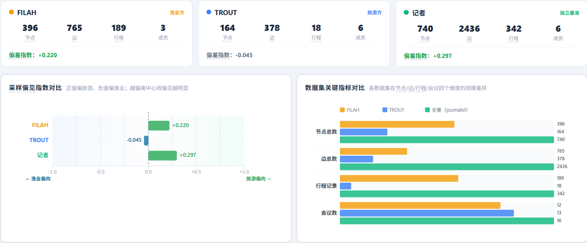
</td>
<td align="center" style="border:none; vertical-align:top;">
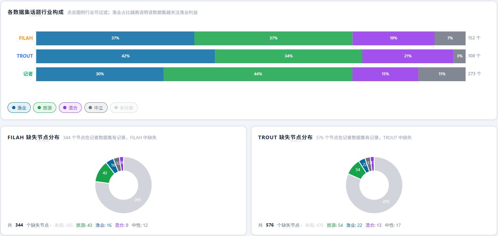
</td>
</tr>
<tr>
<td colspan="2" style="border:none; padding:10px 0 2px; font-size:12px; color:#64748b; text-align:left;"><b>模块二 · 委员行为</b></td>
</tr>
<tr>
<td align="center" style="border:none; vertical-align:top;">
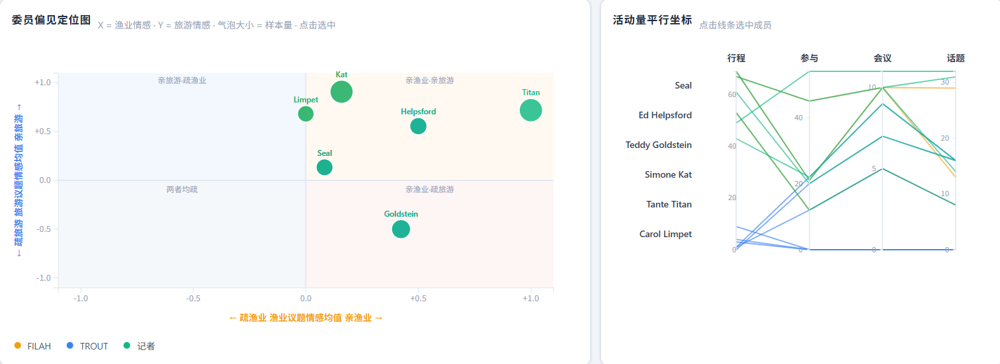
</td>
<td align="center" style="border:none; vertical-align:top;">
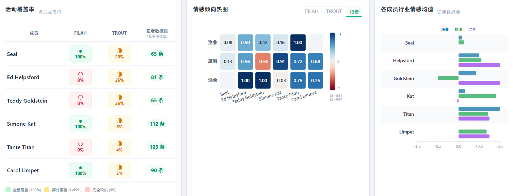
</td>
</tr>
<tr>
<td colspan="2" style="border:none; vertical-align:top; padding-top:4px;">
<table width="100%" cellspacing="8" cellpadding="0" style="border:none; table-layout:fixed;">
<colgroup><col style="width:70%;" /><col style="width:30%;" /></colgroup>
<tr>
<td align="center" style="border:none; vertical-align:top;">
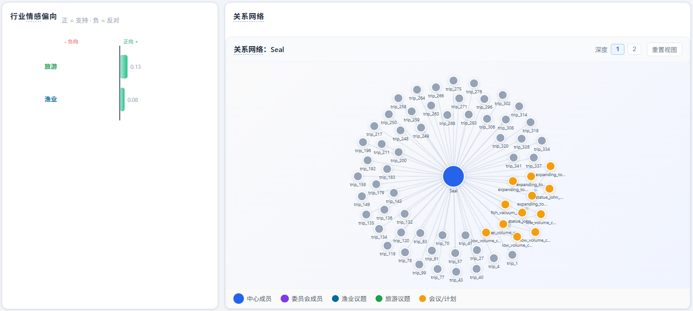
</td>
<td align="center" style="border:none; vertical-align:top;">
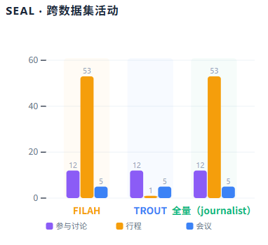
</td>
</tr>
</table>
</td>
</tr>
<tr>
<td colspan="2" style="border:none; padding:10px 0 2px; font-size:12px; color:#64748b; text-align:left;"><b>模块三 · 行程地图</b></td>
</tr>
<tr>
<td colspan="2" align="center" style="border:none; vertical-align:top;">
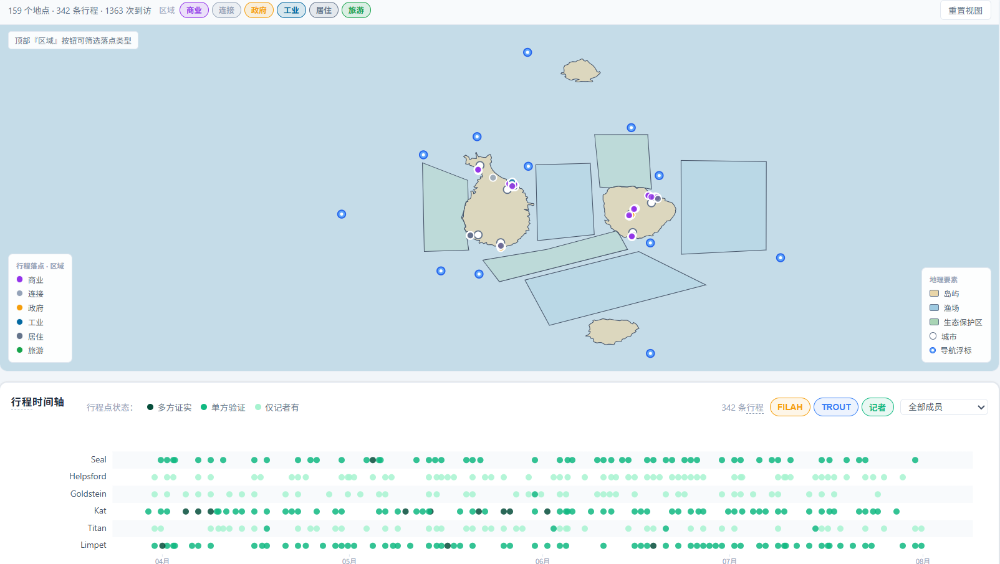
</td>
</tr>
<tr>
<td colspan="2" align="center" style="border:none; vertical-align:top; padding-top:4px;">
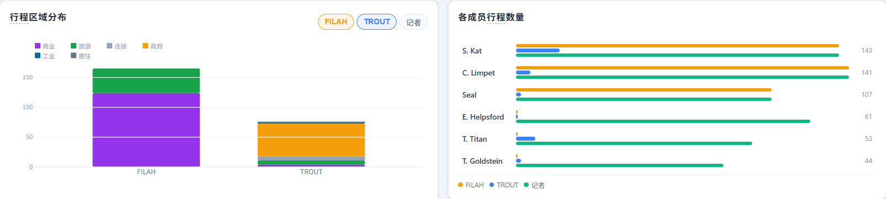
</td>
</tr>
</table>
我们的可视化应用程序采用**左侧导航 + 右侧主视图**布局，包含三个相互补充的分析模块，对应「宏观偏见 → 个体行为 → 时空证据」三层调查逻辑：

| 模块 | 核心图表 |
|------|----------|
| **偏见全景** | KPI 指标卡、采样偏见指数对比、数据集关键指标对比、话题行业构成、FILAH/TROUT 缺失节点分布 |
| **委员行为** | 委员偏见定位散点图、活动量平行坐标、活动覆盖率矩阵、情感倾向热图、跨数据集活动对比、关系网络（Ego） |
| **行程地图** | Oceanus 官方地图、行程时间轴（含证据一致性图例）、行程区域分布、各成员行程数量 |

**设计思路：**

记者 Moray 需要判断 FILAH 与 TROUT 各自能否用**自身提交的记录**支撑对委员会的指控，并在合并全量记录后辨认真实行为与子集叙事之间的偏差。知识图谱中委员、会议、行程、议题以多种边相连，若直接阅读原始 JSON，调查员极易被单方材料的规模或情感色彩带偏。因此，我们将系统组织为三个由粗到细、相互印证的视图，并始终以记者全量数据集（journalist）作为对照基准：

- 偏见全景模块并列展示三个数据集的节点规模、偏差指数与缺失节点，使 Moray 可以清晰看出 FILAH 与 TROUT 数据集中「漏人、漏行程、删议题」等采样偏见。
- 委员行为模块在同一坐标系下对比六名成员在三个数据集中的活动量、覆盖率与情感倾向，并支持点击成员后展开个人跨数据集活动与关系网络，以回答委员会整体是否偏袒以及个体故事如何被子集改写。
- 行程地图模块将 trip 落点与时间轴叠加在 Oceanus 官方底图上，用空间分布与证据一致性图例检验前述议题偏见是否体现在实地考察中。

**交互设计要点：**

- 委员行为页支持**点击成员行/散点/平行坐标线条**联动选中，右侧展开「跨数据集活动」与「关系网络」。
- 情感热图支持 FILAH / TROUT / 记者三标签切换，对比同一成员在不同材料中的「有值 / 缺失」。
- 行程地图页采用**地图 + 时间轴 + 统计图**纵向联动：时间轴顶栏提供 FILAH / TROUT / 记者**多选数据集选项**与成员下拉，地图与成员统计随当前选中数据集与成员同步过滤；记者模式下时间轴以绿点深浅标注**多方证实 / 单方验证 / 仅记者有**。
- 地图顶栏提供**落点区域类型多选选项**（商业、政府、旅游等），可对比不同功能区落点分布；
- 地图落点支持点击选中与悬停高亮，非焦点落点半透明显示以便对比；选中成员时叠加该成员行程路径折线。
- 各图表标题旁集成 **TermExplanation** 术语悬浮说明（包括各类分析指标），降低 Moray 等非图谱专家的理解门槛。

---

## MC2.1（Q1）：各方指控是否被其自身数据集支持？

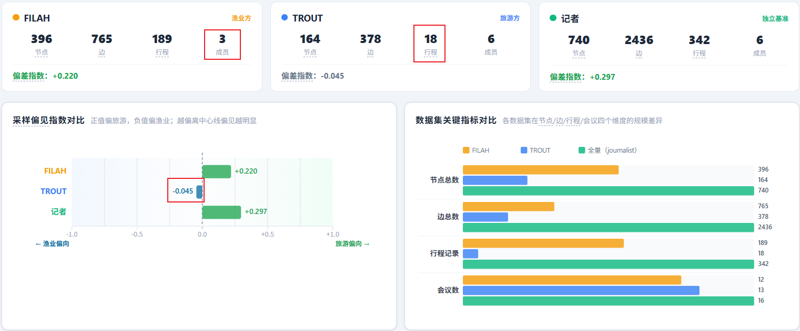

<center>图2-1 偏见全景 · 数据集规模与会议对比</center>

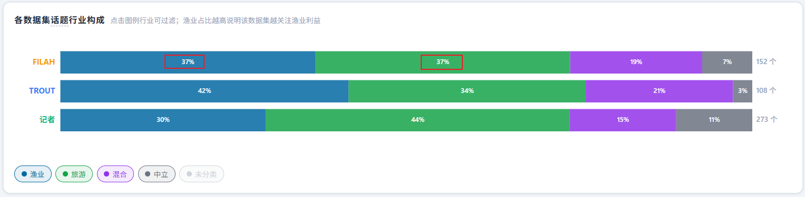

<center>图2-2 偏见全景 · 采样偏见指数与话题行业构成</center>

图2-1 显示 FILAH 数据集有 189 条行程，委员仅 3 人（Seal、Simone Kat、Carol Limpet）；TROUT 数据集六名委员齐全，行程却仅 18 条。两数据集的话题一致，会议数量（12 对 13）接近，容易误判它们一样完整，实则行程与人员严重失衡。

FILAH 整体偏差指数（bias_index）为 +0.220，方向上有利于渔业方「委员会偏旅游」的指控；TROUT 为 −0.046，几乎中性，旅游方「偏渔业」缺乏数值支撑。图2-2 中 FILAH 中渔业与旅游议题占比相同，议题数量看似均衡，偏差指数却仍为正值，说明渔业方在选材时可能更侧重能让委员会**显得倾向旅游**的会议与讨论，而不只是议题条目的多少。

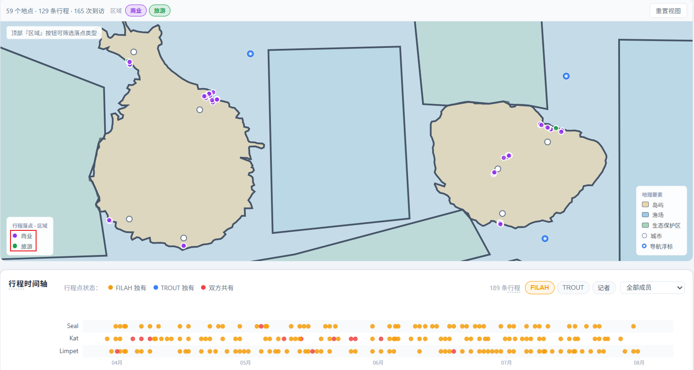

<center>图3-1 行程地图 · FILAH 行程区域分布</center>

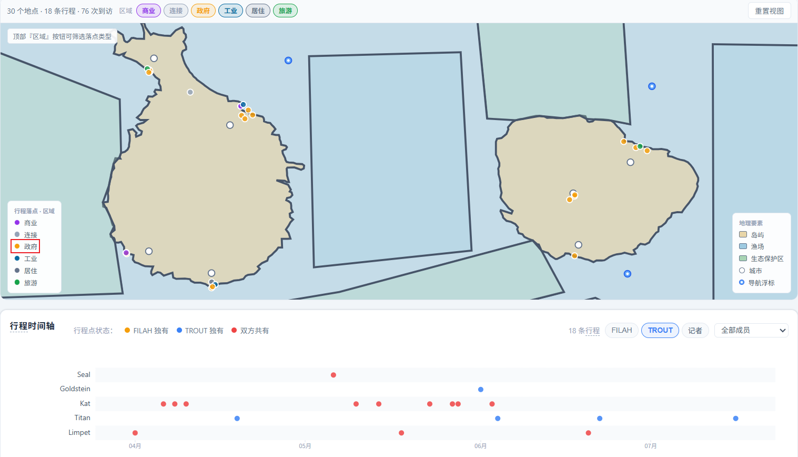

<center>图3-2 行程地图 · TROUT 行程区域分布</center>

图3-1 显示 FILAH 数据集的落点访问中，以商业区和旅游区为主，实地活动高度指向旅游经济界面；图3-2 则表明 TROUT 数据集的行程访问中，政府区居多，商业与旅游较少。前者为「偏旅游」提供了空间证据，但建立在漏掉 Helpsford、Goldstein、Titan 三人的前提下；后者把场景锁定在机关会议，政府区落点不等于渔业偏好，旅游方指控缺少行为级依据。

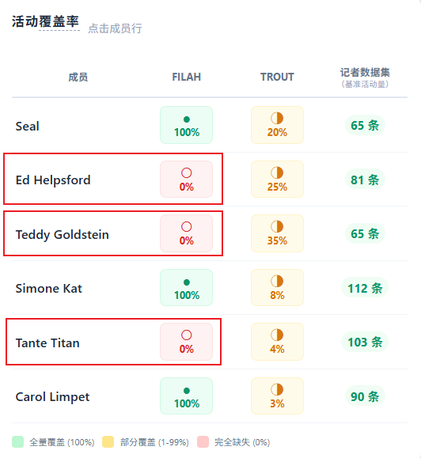

<center>图4 委员行为 · 活动覆盖率矩阵</center>

图4 为委员行为页「活动覆盖率」矩阵。FILAH 列中 Kat、Limpet、Seal 覆盖率均为 100%，Helpsford、Goldstein、Titan 为 0%；TROUT 列中 Kat、Limpet 仅约 8% 与 3%，Helpsford、Goldstein 相对较高。两列颜色分布互斥，表明两数据集呈现的是两套不同的证人组合，而非同一委员会全貌——这本身就是采样偏见的体现。

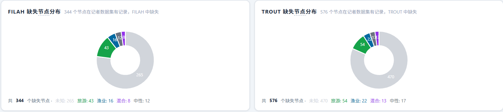

<center>图5 偏见全景 · FILAH 与 TROUT 缺失节点分布</center>

图5 为偏见全景最下行 FILAH / TROUT「缺失节点分布」环图。FILAH 共缺 344 个、TROUT 共缺 576 个（相对记者全量）。环图按议题行业着色：可识别类别中旅游类缺失多于渔业类，缺失呈定向性；TROUT 缺失总量更大，与图2-1 中仅 18 条行程相呼应。

**数据异常与跨图对照：** 图2-1 若仅看会议数（12 对 13），会以为两数据集「外壳」一样厚；但同图行程悬殊（189 对 18）、人员覆盖亦不对等，说明**账本条目**层面可能不完整。图3-1、图3-2显示：落到地图上，FILAH 落点堆在商业区与旅游区，TROUT 落点堆在政府区——同一委员会若被如实记录，空间足迹不应随提交方切换而变成两套几乎不重叠的景观。换言之，**条目规模**（会议、行程等图谱计数）与**空间行为**（委员实际去了哪里）有被拆开编排嫌疑：一方用「会议差不多」营造完整感，再用落点图案支撑「偏旅游」；另一方保留政府区场景，却删掉多数旅游实地。图4、图5 进一步显示这种编排还伴随删人、删节点，猜测整体更像是选择性剪辑，而非随机性缺漏。

**结论：** FILAH 数据集部分支持「委员会偏旅游」——偏差指数为正、商业/旅游落点密集，但半数委员缺席，不能代表委员会整体。TROUT 数据集几乎不支持「偏渔业」——偏差指数接近零，空间证据主要是政府区会议场景。两数据集均有明显采样偏见，Moray 不应单独采信任一方；它们表现出双方可能都在裁剪记录，而非指控已被自身数据充分证实。

---

## MC2.2（Q2）：委员会整体是否偏袒？成员如何分配时间？

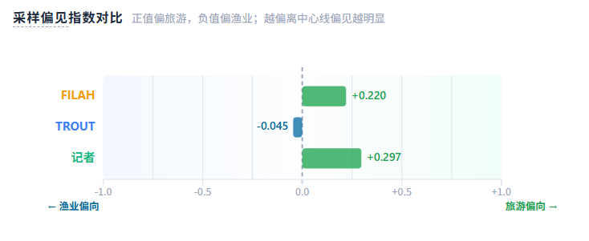

<center>图6 偏见全景 · 记者全量整体偏差指数</center>

图6 在全量知识图谱上汇总委员会渔业/旅游议题参与：记者数据集整体偏差指数为 **+0.297**，呈**轻度偏旅游**。该值离 +1 较远，更接近经济转型背景下议题关注略向旅游倾斜，尚不足以单独证明「委员会集体蓄意偏袒」；但方向明确，Moray 不能称委员会对两业完全中立。

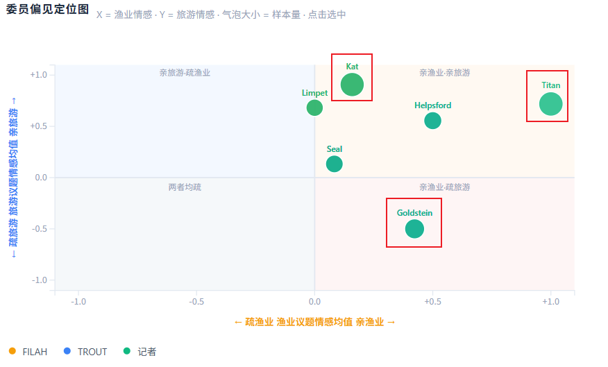

<center>图7-1 委员行为 · 委员偏见定位图（记者全量）</center>

图7-1 把图6 的整体结论拆到个人（横轴渔业情感、纵轴旅游情感、气泡大小为样本量，均来自记者数据集）：Simone Kat（渔业 0.16、旅游 0.91）与 Tante Titan（渔业 1.00、旅游 0.72）旅游情感突出，同时 Tante Titan 更加偏向渔业；Teddy Goldstein 旅游情感为 **−0.50**、渔业 0.42，相对亲渔业；Seal（两轴均约 0.1）接近中立。六人散点分散，说明**宏观一个不能代表六人立场，内部存在亲渔业制衡声音，整体轻度偏旅游并不等于人人亲旅游**。

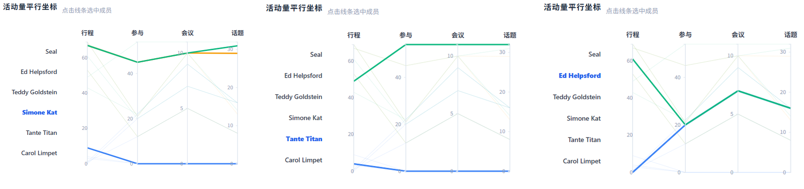

<center>图7-2 委员行为 · 活动量平行坐标（记者全量 · 左 Kat / 中 Titan / 右 Helpsford）</center>

图7-2 一排放置三人的记者绿线，展示全量下三种典型**时间分配模式**（按结构类型选取，并非行程数最高的三人）：**Kat**（左）四轴均处高位（行程 67、参与 45、会议 10、话题 31），议题、会议与实地考察并重；**Titan**（中）参与 54、会议 11、话题 32 为六人之冠，行程 49 居中，偏议题驱动型；**Helpsford**（右）行程 61 突出而参与仅 20、会议 7，偏实地考察型。折线形态互异，**委员会没有统一的日程模板**。

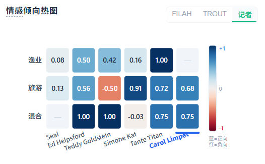

<center>图8 委员行为 · 情感倾向热图（记者全量）</center>

图8 从产业维度补充图7-1：记者全量下 Kat、Limpet 在偏向旅游，Goldstein 在渔业格更积极，Helpsford、Seal 多格接近中性。情感在成员间、产业间分布不均，说明偏袒若存在，也更像**分工各异的立场组合**，而非整体的偏袒。

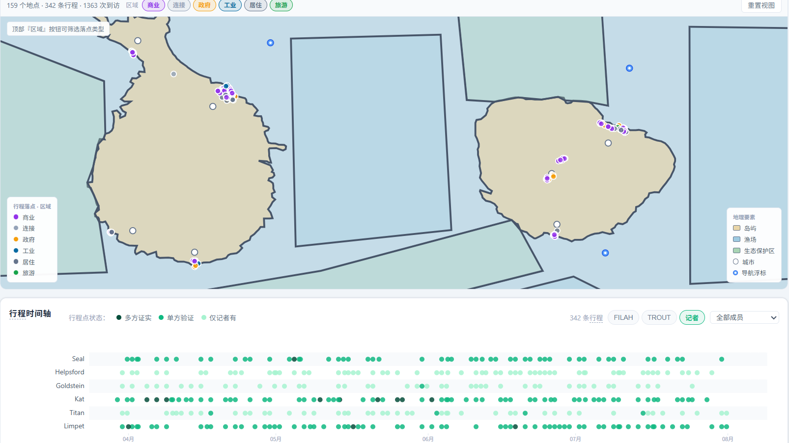

<center>图9 行程地图 · 记者全量（区域分布与时间轴）</center>

图9 上半为空间分配、下半为时间分配：全量落点访问共约 1363 次，政府区为主（固定地点，到访次数多，图中选中政府落点可以看到到访次数均偏多），商业区、旅游区亦有较多记录；时间轴上六人在 4–8 月均有行程点，忙季与空档因人而异。空间上政府区绝对主导；时间上六条日程并行，无统一集体动线。

**数据异常与猜测：** 图6 整体偏差指数 +0.297，方向略偏旅游，而图9 落点集中在政府区、旅游区访问不如政府区——**议题话语的轻微偏旅游，与实地考察的空间结构并不平行**，猜测委员会大量工作发生在机关协调场景，「偏旅游」更多体现在会议讨论权重，而非实地行程压倒渔业相关区域。

**结论：** 在 Moray 合并后的全量知识图谱上，委员会整体**轻度偏旅游**（偏差指数 +0.297），但幅度温和，在正常范围内，而非刻意偏袒，且六成员在情感立场、活动结构、空间落点与时间分布上存在差异，不宜用任何单一委员概括委员会整体。

---

## MC2.3（Q3）：子集结论在全量背景下如何变化？

本问对比 FILAH、TROUT 两个子集与记者全量：**子集得出的结论，在全量背景下是否仍成立？** 回答 TROUT「委员会偏袒渔业」的指控是被加强、削弱还是不变。


<center>图10 偏见全景 · 三数据集偏差指数对比</center>

图10 是问题3的核心尺：仅看 TROUT 数据集，偏差指数约 −0.046，似乎略偏渔业；换到记者全量，同一指标升至 +0.297，**方向反转**为偏旅游。FILAH 的 +0.220 与全量同向但更低。可见：**子集给出的「偏袒」判断，合并全量后可能完全改写**。

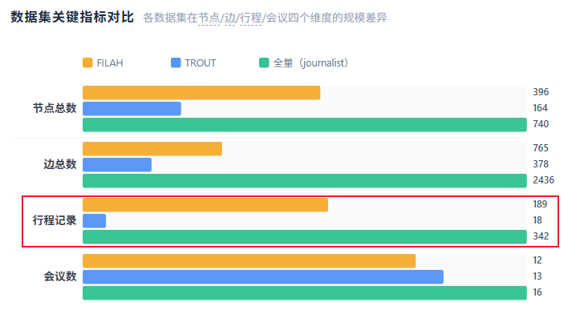

<center>图11-1 偏见全景 · 数据集关键指标对比（行程记录）</center>

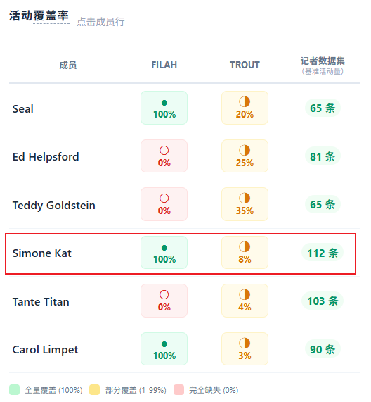

<center>图11-2 委员行为 · 活动覆盖率矩阵</center>

图11-1 解释偏差指数为何会变：TROUT 仅 18 条行程，FILAH 189 条，记者 342 条——子集**物理体量**就不足以代表委员会。图11-2 进一步显示：同一委员在 FILAH、TROUT、记者三列覆盖率悬殊（如 Kat 在 FILAH 为 100%、TROUT 约 8%、记者列为全量基准），说明子集讲述的是**不同人的不同故事**，不是全量的缩略图。

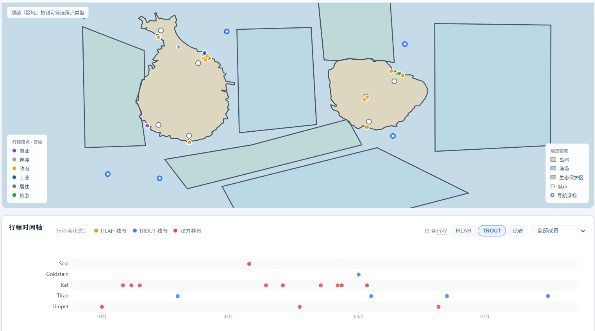

<center>图12-1 行程地图 · TROUT 行程区域分布</center>

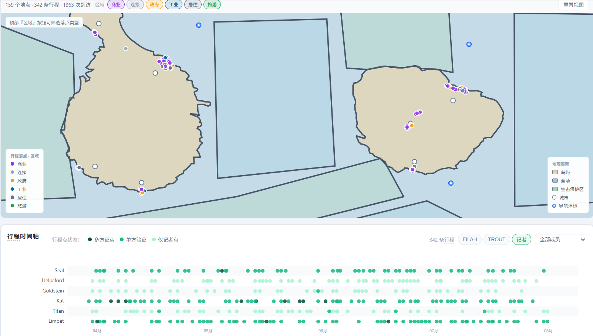

<center>图12-2 行程地图 · 记者全量行程区域分布</center>

图12-1 与图12-2 并排对照空间叙事：TROUT 落点几乎挤在政府区，旅游实地极少，容易支撑「偏渔业」印象；记者全量则政府区仍最多，但商业、旅游、连接等区域均有显著落点。**全量补上了 TROUT 缺失的旅游相关实地**，使「偏渔业」的空间证据不成立——这是 TROUT 指控被削弱的重要视觉原因。

**数据异常与跨图对照：** 图10 议题维度反转，图11-1 行程体量悬殊，图11-2 覆盖率互斥，图12 空间足迹从「单一政府场景」扩展为「多区域并存」——四组证据指向同一猜测：子集不是全量的随机样本，而是**定向裁剪**。

**结论：** 分别对照全量后，两子集给出的判断截然不同：

**FILAH 子集结论 vs 全量：** FILAH 单独看，偏差指数 +0.220、商业/旅游落点密集，可**部分支持**「委员会偏旅游」；但仅含 Seal、Kat、Limpet 三人，Helpsford、Goldstein、Titan 活动为零。换到全量后，偏差指数升至 **+0.297**，方向**不变**、幅度略强，且六人活动与 342 条行程齐备——FILAH 的「偏旅游」叙事大体可被全量印证，却不能代表委员会全貌，更不能证明集体偏袒。

**TROUT 子集结论 vs 全量：** TROUT 单独看，偏差指数约 −0.046、落点挤在政府区，旅游方「偏渔业」指控本就**几乎不成立**；若勉强解读为略偏渔业，则与全量 **+0.297（偏旅游）方向相反**。全量补回大量旅游/商业实地与参与记录后，TROUT 所描绘的「政府会议、偏渔业」委员会形象**被显著改写**——在全量背景下，TROUT 相关指控被**削弱乃至推翻**，而非加强。

总括： FILAH 结论与全量**同向但缩水**（漏人、漏行程）；TROUT 结论与全量**反向**（体量过小、空间单一）。Moray 若只引用任一方子集，必须并列全量对照，否则极易误判委员会真实行为。

---

## MC2.4（Q4）：个人深度分析

### 4.a 至少选择一名被 TROUT 指控相关的委员：全量数据如何改变对其活动的理解？

以 **Tante Titan** 为例：TROUT 中有其记录，且三数据集中画像反差极大，适合分析。

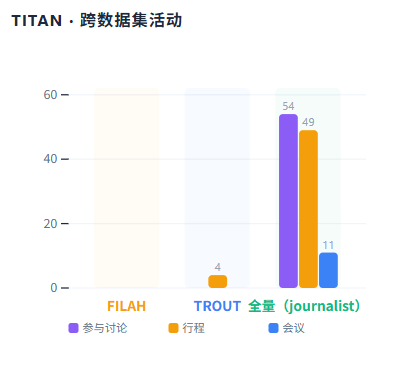

<center>图13 委员行为 · 跨数据集活动（Tante Titan）</center>

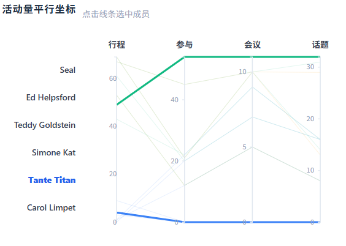

<center>图14 委员行为 · 活动量平行坐标（选中 Tante Titan）</center>

图13 将三数据库活动并排：FILAH 中参与、行程、会议三色柱均为 **0**（完全缺席）；TROUT 仅 **行程 4** 有值；记者全量为参与 **54**、行程 **49**、会议 **11**。图14 中三色折线同步印证：FILAH 无线，TROUT 为贴底短折线，记者绿线四轴拉高。

仅凭 TROUT，Titan 属于**偶尔出现的边缘人**；换到记者全量，其为行程+参与合计 **103** 的高活跃委员，个人偏差指数约 **+0.73**，深度参与旅游议题与实地考察。理解从「是否存在」跃升为「核心参与者及其立场」。

**数据异常与猜测：** 图13、图14 显示同一人在子集里可从「零记录」到「仅 4 条行程」再到「百级活动」，并非随机漏记，更加证实之前按叙事需要**保留一个名字、删掉其余行为链**的猜测。TROUT 给 Moray 的印象与全量严重不符，若不合并记者数据，会系统性低估 Titan 的角色。

**结论：** 对 Titan 而言，更完整数据集将其从 TROUT 下的**边缘人物**改写为**旅游议题高活跃、明显偏旅游的核心委员**；FILAH 则干脆将其抹除。个人深度分析必须以记者全量为底，子集只能作对照。

---

### 4.b 原 TROUT 数据中最影响判断变化的关键缺失证据是什么？

仍聚焦 Titan：TROUT 仅保留 4 条行程、零参与，与全量 103 条活动相比，约 **96%** 证据缺失（活动量缺口见图13）。以下两图定位「删掉了什么」。

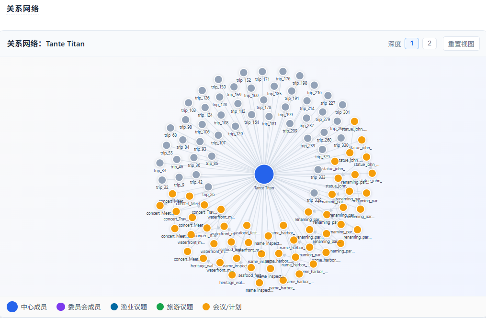

<center>图15 委员行为 · 关系网络（Tante Titan · 记者全量）</center>


<center>图16 行程地图 · Tante Titan 行程时间轴（记者全量）</center>

图15 在全量 ego 网络中，Titan 经 participant 边连接旅游议题、讨论与 trip 节点，构成议题—会议—实地链条。图16 显示其在 4–8 月持续有行程散点，覆盖多个月份，而非 TROUT 所呈现的零星点缀。对照图13，可确认被删的主要是两类证据：**（1）实地 trip 链**——全量 49 条行程在 TROUT 中几乎全无；**（2）旅游议题 participant 边**——全量 54 条参与记录在 TROUT 中缺失，议题层面「偏旅游」立场无法还原。

**数据异常与猜测：** 图13 中 TROUT 只留「行程 4」一根细柱，却删掉全部参与与会议；图15、图16 展示的全量链条在 TROUT 侧被拦腰截断，更像**保留最低存在感、抹掉能证明立场与活跃度的主体活动**。

**结论：** 原 TROUT 数据中最关键的缺失，是 Titan 的**旅游实地行程链**与**旅游议题参与边**；二者缺一，Moray 都会把高活跃、偏旅游的核心委员误判为边缘旁观者。

---

### 4.c 在全量背景下，FILAH 采样偏见对谁的行为影响最大？

FILAH 仅含 Seal、Kat、Limpet 三人活动；对照全量，**Ed Helpsford、Teddy Goldstein、Tante Titan** 在 FILAH 列覆盖率均为 **0%**。

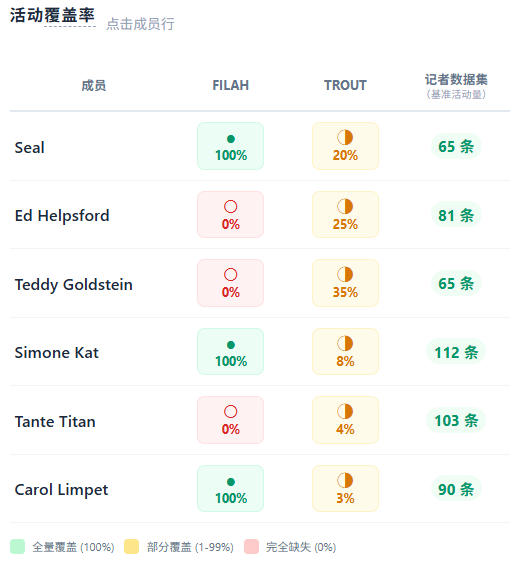

<center>图17 委员行为 · 活动覆盖率矩阵</center>

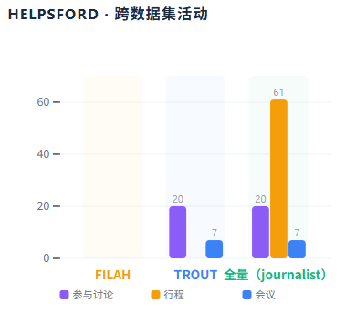

<center>图18 委员行为 · 跨数据集活动（Ed Helpsford）</center>

图17 中 FILAH 列呈「三人满格、三人全空」的割裂格局：Seal、Kat、Limpet 为 100%，Helpsford、Goldstein、Titan 为 0%。图18 以副主席 **Helpsford** 为例：FILAH 三色柱全零，记者全量却有行程 **61**、参与 **20**、会议 **7**——在渔业方材料里「完全不存在」，在全量里却是高行程的实地考察型委员。

三人 FILAH 覆盖率均为 0%，但全量活动量不同：Titan **103** 条、Helpsford **81** 条、Goldstein **65** 条。图18 以 Helpsford 示意「副主席在全量中高度活跃、在 FILAH 中整人消失」；三人里 **Titan 被抹去的绝对活动量最多**。须区分两种读法：其个人偏差指数约 **+0.73**，源于旅游议题 participant 边远多于渔业，**参与结构上偏旅游**；但渔业议题情感均值为 **1.00**、旅游为 **0.72**（见图7-1），情感上并非「只亲旅游」。Goldstein 偏差指数约 **−0.37**，相对亲渔业，纳入 FILAH 才会直接削弱「委员会偏旅游」指控；Titan、Helpsford 被整人抹除，更可能意在**把委员会收缩为 Kat/Limpet/Seal 三人子集**，而非按立场简单删「最亲旅游者」。

**结论：** 在全量背景下，FILAH 采样偏见对 **Tante Titan** 的行为影响最大——其在 FILAH 中记录为零，而记者全量中有 103 条活动，为三人中**被删活动量最多**者；只读 FILAH，会完全不知道这名核心委员的存在，从而严重误判委员会构成。其参与结构虽偏旅游，但渔业情感同样很高，不宜将其简化为「旅游派」来解释 FILAH 的删人逻辑。

---

### 4.d 在全量数据集背景下，展示 FILAH 数据的偏见

在全量背景下审视 FILAH，需同时看「删掉了什么」与「留下来的是什么」。相对记者数据集，FILAH 共缺 **344** 个节点；委员层面，仅 Seal、Kat、Limpet 活动覆盖率 100%，Helpsford、Goldstein、Titan 均为 **0%**（见图17）。

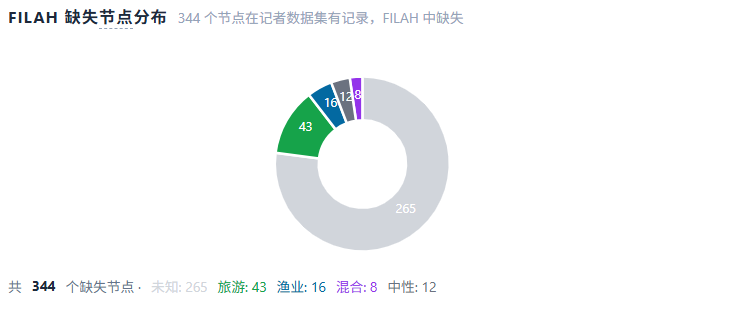

<center>图19 偏见全景 · FILAH 缺失节点分布</center>

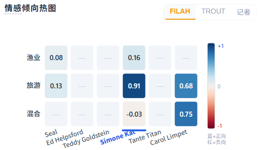

<center>图20 委员行为 · 情感倾向热图（FILAH 数据集）</center>

图19 环图显示，全量有而 FILAH 无的 344 个节点中，可识别类别里旅游类（43）多于渔业类（16），缺失呈**定向性**——FILAH 更大量地削去旅游相关节点。

图20 在 FILAH 标签下呈现六人情感格局：仅 **Seal、Kat、Limpet** 有填色格，**Helpsford、Goldstein、Titan** 在渔业/旅游/混合三行均为「—」，等于在全量里高活跃的副主席与两名核心委员在 FILAH 中**没有情感画像**。对照记者全量热图（图8），六人均有记录，且 Goldstein 渔业格更积极、情感分布更分散。FILAH 保留的三人里，Kat 旅游情感 **0.91**、Limpet 旅游 **0.68**，渔业格偏弱或缺失，读者极易得出「在场委员集体亲旅游」的印象——但这幅印象建立在**半数委员被整人抹除**的前提上。再对照图11-1：FILAH 行程 189 条、委员仅 3 人，记者全量 342 条行程、六人齐全；FILAH 用大量行程体量，只呈现一个三人子集。

FILAH 偏见可概括为三层：**漏人**（三人零覆盖）、**删节点**（344 个、旅游类缺失偏多）、**堆叙事**（保留者行程与情感向旅游倾斜）。渔业方材料呈现的不是委员会全貌，而是经裁剪后**有利于「偏旅游」指控**的证人组合。

**结论：** 在全量背景下，FILAH 表现出明显的**定向采样偏见**——不是少记一点，而是漏掉副主席与高活跃委员、删去大量旅游相关节点、保留亲旅游叙事所需的证人与情感格局。FILAH 可用于理解渔业方**声称**看到了什么，不能用于裁定委员会真实行为。

---

## 综合结论

| 问题 | 结论 |
|------|-----------|
| **Q1** | FILAH 部分支持「偏旅游」，TROUT 弱支持「偏渔业」；双方材料均不能单独采信 |
| **Q2** | 全量整体轻度偏旅游，但成员立场存在分化 |
| **Q3** | 全量削弱甚至反转 TROUT「偏渔业」叙事；FILAH 漏人使「委员会全体」结论失效 |
| **Q4** | Titan 在全量下被 TROUT/FILAH 严重失真；FILAH 采样偏见对其影响最大（零覆盖、103 条活动被抹除） |

**给 Moray 的建议：**

1. 以 **journalist 全量**为唯一裁决基准，FILAH/TROUT 仅作利益方声称对照。  
2. 报道须标注：FILAH 缺 3 名委员全部记录；TROUT 缺 94% 以上行程证据。  
3. 分成员叙述，避免「委员会 = 某一极端委员」。  
